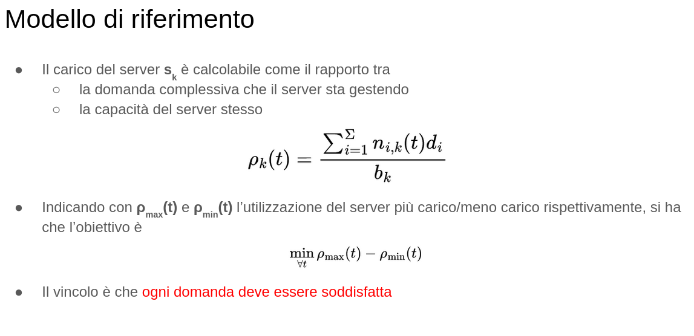

1. Topologia di rete? Chiediamo se va bene
2. Dobbiamo implementare anche router? perchè non funziona?

Generalmente niente Gateway! Fa casino, più controllo sul traffico. Implementare fake gateway e logica di instradamento. (Frame ethernet, rotta statica per i client)
Intercettare richiesta broadcast, e logica di instradamento sui server. 

3. Ogni servizio ha un IP specifico, ed ogni servizio è hostato su un Pool di server, di cui sappiamo i loro IP privati. Abbiamo capito correttamente?

Workflow:
1. Broadcast packet (payload ip gateway)
 - Handle_PacketIn risponde alla request con un MAC fisso come reply
 - flow_mod on ConnectionUp sent on all switches []
 - Client has now everything needed
2. Il client ora invia la sua richiesta al public IP con il suo pacchetto
3. Controller cattura la richiesta, calcola il miglior server (????) e modifica il pacchetto di conseguenza
 - 
4. Switch inoltra il pacchetto alla porta corretta
5. Server elabora ed invia indietro allo switch la risposta
6. Controller riscrive il pacchetto con src-dst ip corretti ed inoltra indietro al client.